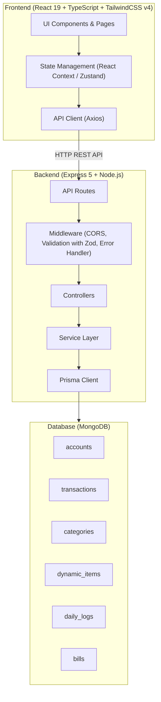
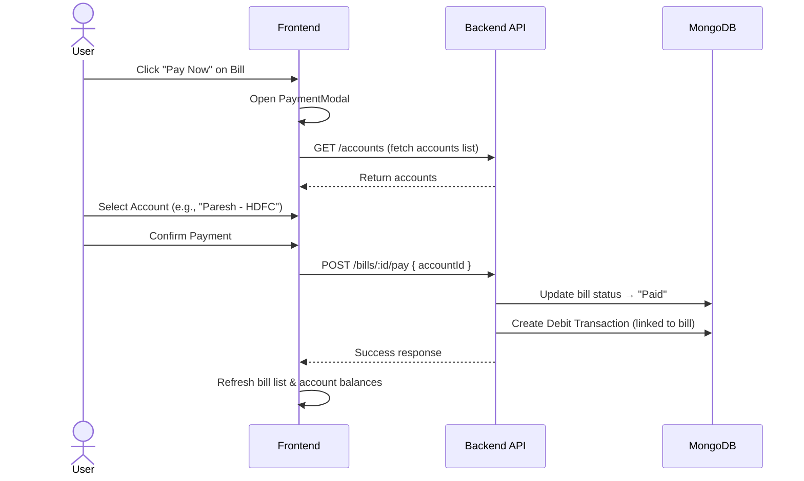
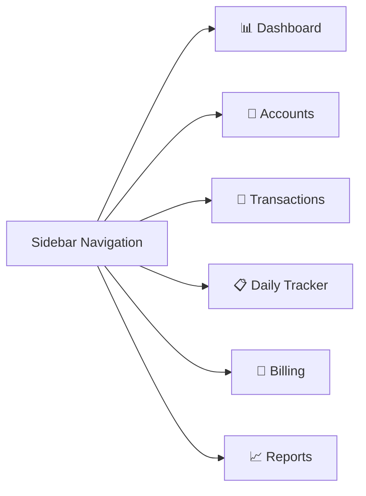

# 🏗️ Master Plan — Daily Expense & Daily Tracking App - Implementation Plan

> **Project:** Daily-Expense-Tracker  
> **Tech Stack:** React 19 + TypeScript + TailwindCSS v4 (Frontend) | Express 5 + Node.js (Backend) | Prisma ORM + Zod (Database & Validation)  
> **Development Mandate:** AI-Assisted Development (Antigravity / LLM-powered workflows)  
> **Date Updated:** 29 July 2026

---

## 📑 Table of Contents

1. [Existing Project Audit](#1-existing-project-audit)
2. [High-Level Architecture](#2-high-level-architecture)
3. [Module Breakdown](#3-module-breakdown)
4. [Database Schema Design](#4-database-schema-design)
5. [Backend API Design](#5-backend-api-design)
6. [Frontend Component Architecture](#6-frontend-component-architecture)
7. [Step-by-Step Implementation Phases](#7-step-by-step-implementation-phases)
8. [Verification Plan](#8-verification-plan)

---

## 1. Existing Project Audit

### What's Already Set Up

| Layer | Status | Details |
|-------|--------|---------|
| **Frontend** | ✅ Scaffolded | Vite + React 19 + TypeScript + TailwindCSS v4. Empty `App.tsx`. |
| **Backend** | ✅ Scaffolded | Express 5 + Prisma + Zod. Empty `index.js`. Has utility helpers (`asyncHandler`, `response`, `statusCodes`, `statusMessages`). |
| **Database** | ⬜ Not started | Prisma is installed but no schema or models exist yet. |
| **Routing** | ⬜ Not started | No React Router or Express routes configured. |
| **Authentication** | ⬜ Not started | No auth layer exists (not in current scope). |

### Existing Utilities to Leverage

- [asyncHandler.js](file:///c:/Users/Patel%20Jainish/Videos/Desktop/Daily-Expense-Tracker/backend/src/utils/asyncHandler.js) — Wraps async route handlers to catch errors automatically.
- [response.js](file:///c:/Users/Patel%20Jainish/Videos/Desktop/Daily-Expense-Tracker/backend/src/utils/response.js) — Standardized `sendSuccess()` / `sendError()` response helpers.
- [statusCodes.js](file:///c:/Users/Patel%20Jainish/Videos/Desktop/Daily-Expense-Tracker/backend/src/constants/statusCodes.js) — HTTP status code constants.
- [statusMessages.js](file:///c:/Users/Patel%20Jainish/Videos/Desktop/Daily-Expense-Tracker/backend/src/constants/statusMessages.js) — Standardized success/error messages.

---

## 2. High-Level Architecture



### Folder Structure (Target)

```
Daily-Expense-Tracker/
├── backend/
│   ├── .env
│   ├── .env.example
│   ├── package.json
│   └── src/
│       ├── index.js                  # App entry, Express setup, DB connect
│       ├── config/
│       │   └── db.js                 # MongoDB connection logic
│       │   └── db.js                 # Database connection logic
│       ├── constants/
│       │   ├── statusCodes.js        ✅ EXISTS
│       │   └── statusMessages.js     ✅ EXISTS
│       ├── middleware/
│       │   ├── errorHandler.js       # Global error handler
│       │   └── validate.js           # Request validation middleware
│       ├── validations/
│       │   └── schemas.js            # Zod validation schemas
│       ├── prisma/
│       │   └── schema.prisma         # Prisma schema definition
│       ├── routes/
│       │   └── v1/
│       │       ├── index.js
│       │       ├── auth.routes.js
│       │       ├── account.routes.js
│       │       ├── category.routes.js
│       │       ├── transaction.routes.js
│       │       ├── dynamicItem.routes.js
│       │       ├── dailyLog.routes.js
│       │       └── bill.routes.js
│       ├── controllers/
│       │   ├── accountController.js
│       │   ├── categoryController.js
│       │   ├── transactionController.js
│       │   ├── dynamicItemController.js
│       │   ├── dailyLogController.js
│       │   └── billController.js
│       ├── services/
│       │   ├── accountService.js
│       │   ├── transactionService.js
│       │   ├── billingService.js      # Bill generation & payment logic
│       │   └── reportService.js       # Aggregation & filtering
│       └── utils/
│           ├── asyncHandler.js       ✅ EXISTS
│           └── response.js           ✅ EXISTS
│
├── frontend/
│   ├── .env
│   ├── package.json
│   ├── index.html
│   ├── vite.config.ts
│   └── src/
│       ├── main.tsx
│       ├── App.tsx
│       ├── index.css
│       ├── api/                       # API client layer
│       │   ├── axiosInstance.ts
│       │   ├── accountApi.ts
│       │   ├── categoryApi.ts
│       │   ├── transactionApi.ts
│       │   ├── dynamicItemApi.ts
│       │   ├── dailyLogApi.ts
│       │   └── billApi.ts
│       ├── components/                # Reusable UI components
│       │   ├── layout/
│       │   │   ├── Sidebar.tsx
│       │   │   ├── Header.tsx
│       │   │   └── MainLayout.tsx
│       │   ├── ui/
│       │   │   ├── Button.tsx
│       │   │   ├── Card.tsx
│       │   │   ├── Modal.tsx
│       │   │   ├── Table.tsx
│       │   │   ├── Input.tsx
│       │   │   ├── Select.tsx
│       │   │   ├── DatePicker.tsx
│       │   │   ├── Badge.tsx
│       │   │   └── Toast.tsx
│       │   ├── accounts/
│       │   │   ├── AccountCard.tsx
│       │   │   ├── AccountForm.tsx
│       │   │   └── AccountList.tsx
│       │   ├── transactions/
│       │   │   ├── TransactionForm.tsx
│       │   │   ├── TransactionList.tsx
│       │   │   └── TransactionFilters.tsx
│       │   ├── daily-tracker/
│       │   │   ├── DynamicItemForm.tsx
│       │   │   ├── DailyLogGrid.tsx
│       │   │   └── QuickEntryRow.tsx
│       │   ├── billing/
│       │   │   ├── BillGenerator.tsx
│       │   │   ├── BillCard.tsx
│       │   │   ├── BillList.tsx
│       │   │   └── PaymentModal.tsx
│       │   └── reports/
│       │       ├── FilterPanel.tsx
│       │       ├── SummaryCards.tsx
│       │       └── ChartView.tsx
│       ├── pages/
│       │   ├── Dashboard.tsx
│       │   ├── AccountsPage.tsx
│       │   ├── TransactionsPage.tsx
│       │   ├── DailyTrackerPage.tsx
│       │   ├── BillingPage.tsx
│       │   └── ReportsPage.tsx
│       ├── context/                   # React Context for state
│       │   └── AppContext.tsx
│       ├── hooks/                     # Custom hooks
│       │   ├── useAccounts.ts
│       │   ├── useTransactions.ts
│       │   ├── useDailyLogs.ts
│       │   └── useBills.ts
│       ├── types/                     # TypeScript interfaces
│       │   └── index.ts
│       └── utils/
│           ├── formatters.ts          # Currency, date formatters
│           └── validators.ts          # Client-side validation
```

---

## 3. Module Breakdown

### Module 1: Account & Bank Management (Ledger)

> **Purpose:** Create and manage multiple bank accounts and cash reserves with real-time running balances.

| Feature | Description |
|---------|-------------|
| Create Account | Add accounts like "Paresh - HDFC", "Cash - Home", etc. |
| Edit Account | Update account name, type, initial balance |
| Delete Account | Soft-delete with balance check (prevent if balance ≠ 0 or linked transactions exist) |
| View Balance | Real-time running balance for each account |
| Account Types | `bank`, `cash`, `wallet` (extensible enum) |

**Business Rules:**
- Balance is **computed** from initial balance + sum of all linked credits - sum of all linked debits
- Cannot delete an account that has linked transactions (must reassign or archive)
- Account names must be unique

---

### Module 2: General Expense Management (Credit & Debit)

> **Purpose:** Log standard daily expenses and incomes, linked to specific accounts.

| Feature | Description |
|---------|-------------|
| Add Transaction | Amount, Date, Type (Credit/Debit), Category, Description, Account |
| Edit Transaction | Modify any field; recalculates affected account balance |
| Delete Transaction | Removes entry; recalculates affected account balance |
| Categories | User-defined categories (Food, Transport, Salary, Rent, etc.) |
| Mandatory Account Link | Every transaction MUST select a source/destination account |

**Business Rules:**
- **Credit** = money entering the selected account (balance increases)
- **Debit** = money leaving the selected account (balance decreases)
- Date defaults to today but can be backdated
- Categories are user-managed (CRUD on categories)

---

### Module 3: Dynamic Daily Item Tracking

> **Purpose:** Track recurring daily items (Milk, Water Bottles, Newspapers, etc.) with full flexibility.

| Feature | Description |
|---------|-------------|
| Create Dynamic Item | Name, default unit price, unit label (liters/pieces/copies), vendor name (optional) |
| Edit/Delete Item | Modify item details or soft-delete |
| Daily Log Entry | Quick calendar/grid UI to log quantity per day per item |
| Skip/Zero Entry | Mark a day as "0" or skip (no delivery) |
| Bulk Entry | Log multiple items for the same day in one view |

**Business Rules:**
- Items are fully user-defined (no hardcoded items)
- Unit price can be overridden at the time of bill generation
- Daily logs are unique per (item + date) combination
- Default view shows current month in calendar/grid format

---

### Module 4: Automated Billing & Payment

> **Purpose:** Auto-generate consolidated bills from daily logs and track payment status against ledger accounts.

| Feature | Description |
|---------|-------------|
| Generate Bill | Select item + date range → system aggregates quantities × unit price |
| Bill Preview | Show breakdown before confirming generation |
| Bill Status | `Pending` or `Paid` |
| Pay Bill | Select payment source account → auto-create debit transaction |
| Bill History | View all generated bills with status filters |

**Business Rules:**
- **Bill Calculation:** `Total Quantity (in date range) × Unit Price = Total Bill Amount`
- When bill is marked **Paid**, TWO things happen simultaneously:
  1. Bill status → `Paid` (with payment date & source account recorded)
  2. A **Debit transaction** is auto-created in the selected account, linked back to the bill
- Prevent duplicate bill generation for same item + overlapping date ranges
- Allow partial payments in future iterations (v2)

**Payment Flow:**



---

### Module 5: Advanced Filtering & Reporting

> **Purpose:** Deep filtering and time-based views across all data.

| Feature | Description |
|---------|-------------|
| Filter by Type | Credit / Debit |
| Filter by Account | Specific bank or cash account |
| Filter by Category | Transaction category |
| Filter by Payment Status | Paid / Pending (for bills) |
| Filter by Item | Specific dynamic item |
| Weekly View | Aggregate data by week |
| Monthly View | Aggregate data by month |
| Custom Date Range | User-defined start/end dates |
| Summary Cards | Total income, total expenses, net balance, pending bills |

---

## 4. Database Schema Design (Prisma / DBML)

```dbml
Enum account_kind {
  bank
  cash
}

Enum txn_type {
  credit
  debit
}

Enum bill_status {
  pending
  paid
}

Table users {
  id uuid [pk]
  full_name varchar(150) [not null]
  email varchar(255) [not null, unique]
  password_hash text [not null]
  is_active boolean [default: true]
  created_at timestamptz [not null]
  updated_at timestamptz
  deleted_at timestamptz
}

Table accounts {
  id uuid [pk]
  user_id uuid [not null]
  name varchar(100) [not null]
  kind account_kind [not null]
  opening_balance numeric(14,2) [default: 0]
  created_at timestamptz [not null]
  updated_at timestamptz
  deleted_at timestamptz
}

Table categories {
  id uuid [pk]
  user_id uuid [not null]
  name varchar(100) [not null]
  created_at timestamptz [not null]
  updated_at timestamptz
  deleted_at timestamptz
}

Table transactions {
  id uuid [pk]
  user_id uuid [not null]
  account_id uuid [not null]
  category_id uuid
  type txn_type [not null]
  amount numeric(14,2) [not null]
  description text
  occurred_on date [not null]
  bill_id uuid
  created_at timestamptz [not null]
  updated_at timestamptz
}

Table tracker_items {
  id uuid [pk]
  user_id uuid [not null]
  name varchar(150) [not null]
  unit varchar(30) [not null]
  is_active boolean [default: true]
  created_at timestamptz [not null]
  updated_at timestamptz
  deleted_at timestamptz
}

Table tracker_logs {
  id uuid [pk]
  user_id uuid [not null]
  item_id uuid [not null]
  log_date date [not null]
  quantity numeric(14,3) [not null]
  amount numeric(14,2) [not null]
  note text
  created_at timestamptz [not null]
  updated_at timestamptz
}

Table bills {
  id uuid [pk]
  user_id uuid [not null]
  item_id uuid [not null]
  period_start date [not null]
  period_end date [not null]
  total_quantity numeric(14,3) [not null]
  total_amount numeric(14,2) [not null]
  status bill_status [default: 'pending']
  paid_account_id uuid
  paid_on date
  created_at timestamptz [not null]
  updated_at timestamptz
}

// ======================
// Relationships
// ======================

Ref: accounts.user_id > users.id
Ref: categories.user_id > users.id
Ref: tracker_items.user_id > users.id
Ref: tracker_logs.user_id > users.id
Ref: bills.user_id > users.id
Ref: transactions.user_id > users.id
Ref: transactions.account_id > accounts.id
Ref: bills.paid_account_id > accounts.id
Ref: transactions.(category_id, user_id) > categories.(id, user_id)
Ref: tracker_logs.item_id > tracker_items.id
Ref: bills.item_id > tracker_items.id
Ref: transactions.bill_id > bills.id
```

---

## 5. Backend API Design

### 5.1 Authentication APIs

| Method | Endpoint | Description |
|--------|----------|-------------|
| `POST` | `/api/auth/register` | Register a new user |
| `POST` | `/api/auth/login` | Authenticate user & return JWT |
| `GET` | `/api/auth/me` | Get current logged-in user profile |

---

### 5.2 Account APIs

| Method | Endpoint | Description |
|--------|----------|-------------|
| `GET` | `/api/accounts` | List all active accounts with current balances |
| `GET` | `/api/accounts/:id` | Get single account with balance details |
| `POST` | `/api/accounts` | Create new account |
| `PUT` | `/api/accounts/:id` | Update account details |
| `DELETE` | `/api/accounts/:id` | Soft-delete account (set `isActive: false`) |
| `GET` | `/api/accounts/:id/transactions` | Get all transactions for a specific account |

---

### 5.3 Category APIs

| Method | Endpoint | Description |
|--------|----------|-------------|
| `GET` | `/api/categories` | List all categories |
| `POST` | `/api/categories` | Create new category |
| `PUT` | `/api/categories/:id` | Update category |
| `DELETE` | `/api/categories/:id` | Soft-delete category |

---

### 5.4 Transaction APIs

| Method | Endpoint | Description |
|--------|----------|-------------|
| `GET` | `/api/transactions` | List transactions (with filters: type, account, category, date range) |
| `GET` | `/api/transactions/:id` | Get single transaction |
| `POST` | `/api/transactions` | Create new transaction (updates account balance) |
| `PUT` | `/api/transactions/:id` | Update transaction (recalculates account balance) |
| `DELETE` | `/api/transactions/:id` | Delete transaction (recalculates account balance) |

**Query Params for Filtering:**
```
?type=credit|debit
&account=<accountId>
&category=<categoryId>
&startDate=2026-07-01
&endDate=2026-07-31
&page=1
&limit=20
&sort=date
&order=desc
```

---

### 5.5 Dynamic Item APIs

| Method | Endpoint | Description |
|--------|----------|-------------|
| `GET` | `/api/items` | List all dynamic items |
| `GET` | `/api/items/:id` | Get single item with recent logs |
| `POST` | `/api/items` | Create new dynamic item |
| `PUT` | `/api/items/:id` | Update item details |
| `DELETE` | `/api/items/:id` | Soft-delete item |

---

### 5.6 Daily Log APIs

| Method | Endpoint | Description |
|--------|----------|-------------|
| `GET` | `/api/daily-logs` | Get logs (filter by item, date range) |
| `GET` | `/api/daily-logs/calendar/:itemId` | Get month view data for calendar grid |
| `POST` | `/api/daily-logs` | Create or update daily log entry (upsert) |
| `POST` | `/api/daily-logs/bulk` | Bulk create/update multiple entries at once |
| `DELETE` | `/api/daily-logs/:id` | Delete a specific log entry |

---

### 5.6 Bill APIs

| Method | Endpoint | Description |
|--------|----------|-------------|
| `GET` | `/api/bills` | List bills (filter by item, status, date range) |
| `GET` | `/api/bills/:id` | Get bill with breakdown details |
| `POST` | `/api/bills/generate` | Generate bill for item + date range |
| `POST` | `/api/bills/preview` | Preview bill calculation without saving |
| `POST` | `/api/bills/:id/pay` | Mark bill as paid (creates debit transaction) |

---

### 5.7 Report APIs

| Method | Endpoint | Description |
|--------|----------|-------------|
| `GET` | `/api/reports/summary` | Dashboard summary (total income, expenses, balances) |
| `GET` | `/api/reports/by-category` | Expenses grouped by category |
| `GET` | `/api/reports/by-account` | Transaction summary per account |
| `GET` | `/api/reports/by-period` | Data grouped by week/month |

---

## 6. Frontend Component Architecture

### 6.1 Page Structure & Navigation



### 6.2 Page Descriptions

#### 📊 Dashboard (`Dashboard.tsx`)
- **Summary Cards:** Total Balance (across all accounts), Month's Income, Month's Expenses, Pending Bills Count
- **Recent Transactions:** Last 5-10 transactions
- **Account Overview:** Mini cards showing each account's balance
- **Quick Actions:** "Add Expense", "Log Daily Item", "Generate Bill"

#### 🏦 Accounts Page (`AccountsPage.tsx`)
- **Account Cards Grid:** Each card shows account name, type badge, current balance
- **Add Account Button:** Opens modal form
- **Click Account:** Drill down to see all transactions for that account

#### 💸 Transactions Page (`TransactionsPage.tsx`)
- **Filter Bar:** Type (Credit/Debit), Account dropdown, Category dropdown, Date range picker
- **Transaction Table:** Sortable columns — Date, Description, Category, Account, Amount (color-coded green/red), Type badge
- **Add Transaction FAB:** Opens form with mandatory account selection

#### 📋 Daily Tracker Page (`DailyTrackerPage.tsx`)
- **Item Selector:** Tabs or dropdown to switch between dynamic items
- **Calendar Grid:** Month view showing each day as a cell; user inputs quantity directly into the cell
- **Quick Entry Row:** "Today's entries" — list all items with input fields for quick logging
- **Item Management:** "Manage Items" button opens CRUD modal

#### 🧾 Billing Page (`BillingPage.tsx`)
- **Generate Bill Section:** Select item → date range → preview → confirm
- **Bills Table:** Item name, Period, Total Qty, Unit Price, Total Amount, Status Badge (Paid ✅ / Pending ⏳)
- **Pay Button:** Opens `PaymentModal` with account selector

#### 📈 Reports Page (`ReportsPage.tsx`)
- **Advanced Filter Panel:** All filter dimensions (type, account, category, status, item, date range)
- **View Toggle:** Weekly / Monthly / Custom
- **Charts:** Bar chart (expenses by category), Line chart (balance trend), Pie chart (income vs expenses)
- **Exportable Table:** Filtered data in tabular format

---

### 6.3 Key UI Components

| Component | Purpose | Used In |
|-----------|---------|---------|
| `LoginForm` | User login form | Login Page |
| `RegisterForm` | User registration form | Register Page |
| `ProtectedRoute` | Router wrapper to protect private routes | App.tsx |
| `Sidebar` | Main navigation with icons and labels | All pages |
| `Header` | Page title, breadcrumbs, global search | All pages |
| `AccountCard` | Displays account name, type, balance | Dashboard, Accounts |
| `TransactionForm` | Add/Edit transaction with account selector | Transactions |
| `DailyLogGrid` | Calendar-style grid for quantity entry | Daily Tracker |
| `QuickEntryRow` | Single row for quick daily item logging | Daily Tracker |
| `BillGenerator` | Date range + item selection for bill creation | Billing |
| `PaymentModal` | Account selector popup for bill payment | Billing |
| `FilterPanel` | Multi-dimension filter controls | Transactions, Reports |
| `SummaryCards` | KPI cards (income, expense, balance) | Dashboard, Reports |

---

## 7. Step-by-Step Implementation Phases

### 📌 Phase 0: Project Foundation & Configuration
> **Estimated Effort:** 1 session

- [x] **0.1 Backend Environment Setup:** Configure `.env` with `DATABASE_URL`, `PORT`. Initialize Prisma client.
- [x] **0.2 Express Server Setup:** Set up `index.js` with Express app, CORS, JSON parser, route mounting, error handler, and DB connection call.
- [x] **0.3 Global Middleware:** Create `errorHandler.js` (catches all unhandled errors) and `validate.js` (request body validation).
- [x] **0.4 Frontend Environment Setup:** Configure `.env` with `VITE_API_URL`. Set up Axios instance with base URL and interceptors.
- [x] **0.5 Frontend Routing:** Install `react-router-dom`. Create `App.tsx` with route definitions and `MainLayout` wrapper.
- [x] **0.6 Design System:** Set up TailwindCSS theme tokens in `index.css` — color palette, fonts, component base styles.
- [x] **0.7 Base UI Components:** Build reusable `Button`, `Card`, `Modal`, `Input`, `Select`, `Table`, `Badge`, `Toast` components.

---

### 📌 Phase 1: Authentication & User Management
> **Estimated Effort:** 2 sessions

- [x] **1.1 Backend Auth Setup:** Install `jsonwebtoken` and `bcryptjs`.
- [x] **1.2 Create Auth Controller:** Implement register, login, and me endpoints (`authController.js`).
- [x] **1.3 Create Auth Middleware:** Verify JWT token and attach user to request (`authMiddleware.js`).
- [x] **1.4 Auth Routes:** Mount `authRoutes.js` on Express.
- [x] **1.5 Frontend Auth Setup:** Create `AuthContext.tsx` for global state management.
- [x] **1.6 Axios Interceptor:** Update `axiosInstance.ts` to automatically inject `Authorization` header.
- [x] **1.7 Auth Pages:** Build `LoginPage.tsx` and `RegisterPage.tsx`.
- [x] **1.8 Protected Routing:** Create `ProtectedRoute.tsx` and wrap main app routes in `App.tsx`.
- [x] **1.9 Route Security:** Update all backend existing controllers (like `accountController`) to enforce `req.user.id`.
- [x] **1.10 Test:** Register user, login, verify JWT storage (localStorage), check route protection.

---

### 📌 Phase 2: Module 1 — Account & Ledger Management
> **Estimated Effort:** 1-2 sessions

- [x] **1.1 Define `Account` model in `schema.prisma` and migrate:** Backend — Prisma Schema
- [x] **1.2 Create `accountController.js` with CRUD operations:** Backend — Controller
- [x] **1.3 Create `accountRoutes.js` and mount on Express:** Backend — Routes
- [x] **1.4 Create `accountApi.ts` with Axios calls:** Frontend — API
- [x] **1.5 Build `AccountForm.tsx` (create/edit modal):** Frontend — Component
- [x] **1.6 Build `AccountCard.tsx` (balance display card):** Frontend — Component
- [x] **1.7 Build `AccountList.tsx` (grid of account cards):** Frontend — Component
- [x] **1.8 Build `AccountsPage.tsx` (assembles all account components):** Frontend — Page
- [ ] **1.9 Test:** Create accounts, verify display, check balance shows 0 initially (Verification)

---

### 📌 Phase 3: Module 2 — Category & Transaction Management
> **Estimated Effort:** 2-3 sessions

- [x] **2.1 Define `Category` model in `schema.prisma`:** Backend — Prisma Schema
- [x] **2.2 Create Category CRUD controller + routes:** Backend — Controller/Routes
- [x] **2.3 Define `Transaction` model in `schema.prisma` with account & category refs:** Backend — Prisma Schema
- [x] **2.4 Create `transactionController.js` — CRUD with **balance recalculation logic**:** Backend — Controller
- [x] **2.5 Implement balance update service:** on create/update/delete transaction, recalculate `Account.currentBalance` (Backend — Service)
- [x] **2.6 Create transaction routes with query param filtering:** Backend — Routes
- [x] **2.7 Seed default categories:** (Food, Transport, Salary, Utilities, etc.) (Backend — Seed Script)
- [x] **2.8 Create `categoryApi.ts` and `transactionApi.ts`:** Frontend — API
- [x] **2.9 Build `TransactionForm.tsx` with mandatory account dropdown:** Frontend — Component
- [x] **2.10 Build `TransactionList.tsx` with color-coded amounts:** Frontend — Component
- [x] **2.11 Build `TransactionFilters.tsx` (type, account, category, date range):** Frontend — Component
- [x] **2.12 Build `TransactionsPage.tsx`:** Frontend — Page
- [x] **2.13 Test:** Add credit to "Paresh - HDFC" → verify balance increases. Add debit → verify balance decreases. (Verification)

---

### 📌 Phase 4: Module 3 — Dynamic Item & Daily Tracking
> **Estimated Effort:** 2-3 sessions

- [x] **3.1 Define `DynamicItem` model in `schema.prisma`:** Backend — Prisma Schema
- [x] **3.2 Create DynamicItem CRUD controller + routes:** Backend — Controller/Routes
- [x] **3.3 Define `DailyLog` model in `schema.prisma`:** Backend — Prisma Schema
- [x] **3.4 Create `dailyLogController.js` with upsert and bulk-entry endpoints:** Backend — Controller
- [x] **3.5 Create daily log routes including calendar data endpoint:** Backend — Routes
- [x] **3.6 Create `dynamicItemApi.ts` and `dailyLogApi.ts`:** Frontend — API
- [x] **3.7 Build `DynamicItemForm.tsx` (create/edit item):** Frontend — Component
- [x] **3.8 Build single-item UI (TrackerPage) with Recent Logs:** Frontend — Component
- [x] **3.9 Build Quick Entry logging UI (quantity/amount):** Frontend — Component
- [x] **3.10 Build `TrackerPage.tsx`:** Frontend — Page
- [x] **3.11 Test:** Create "Milk" item → log quantities → verify recent logs display correctly (Verification)

---

### 📌 Phase 5: Module 4 — Automated Billing & Payment
> **Estimated Effort:** 2-3 sessions

- [ ] **4.1 Define `Bill` model in `schema.prisma`:** Backend — Prisma Schema
- [ ] **4.2 Create `billingService.js` — aggregation logic (sum daily logs, calculate total):** Backend — Service
- [ ] **4.3 Create bill generation endpoint (preview + confirm):** Backend — Controller
- [ ] **4.4 Create bill payment endpoint:** **atomic operation:** update bill status + create debit transaction + update account balance (Backend — Controller)
- [ ] **4.5 Create bill routes:** Backend — Routes
- [ ] **4.6 Create `billApi.ts`:** Frontend — API
- [ ] **4.7 Build `BillGenerator.tsx` (item + date range selector + preview):** Frontend — Component
- [ ] **4.8 Build `BillCard.tsx` (bill summary with status badge):** Frontend — Component
- [ ] **4.9 Build `PaymentModal.tsx` (account selector for payment):** Frontend — Component
- [ ] **4.10 Build `BillList.tsx` (filterable list of generated bills):** Frontend — Component
- [ ] **4.11 Build `BillingPage.tsx`:** Frontend — Page
- [ ] **4.12 Test:** Generate bill for Milk (July 1-31) → verify total → pay from "Paresh - HDFC" → verify bill status = Paid, debit transaction created, account balance updated (Verification)

---

### 📌 Phase 6: Module 5 — Dashboard & Reporting
> **Estimated Effort:** 1-2 sessions

- [ ] **5.1 Create `reportService.js` — aggregation pipelines for summaries:** Backend — Service
- [ ] **5.2 Create report endpoints (summary, by-category, by-account, by-period):** Backend — Controller/Routes
- [ ] **5.3 Build `SummaryCards.tsx` (total income, expenses, net, pending bills):** Frontend — Component
- [ ] **5.4 Build `FilterPanel.tsx` (advanced multi-dimension filters):** Frontend — Component
- [ ] **5.5 Build `ChartView.tsx` (bar, line, pie charts using a lightweight chart library):** Frontend — Component
- [ ] **5.6 Build `Dashboard.tsx` (summary + recent transactions + account overview):** Frontend — Page
- [ ] **5.7 Build `ReportsPage.tsx` (filters + charts + data table):** Frontend — Page
- [ ] **5.8 Test:** Verify dashboard shows correct totals. Apply filters → verify data updates. (Verification)

---

### 📌 Phase 7: Polish & Production Readiness
> **Estimated Effort:** 1-2 sessions

- [ ] **6.1 Error Handling:** Toast notifications for all API errors. Loading states and skeletons.
- [ ] **6.2 Form Validation:** Client-side validation on all forms. Server-side validation with meaningful error messages.
- [ ] **6.3 Responsive Design:** Ensure all pages work on mobile, tablet, and desktop. Collapsible sidebar on mobile.
- [ ] **6.4 Animations & Micro-interactions:** Page transitions, card hover effects, button press animations, modal animations.
- [ ] **6.5 Dark Mode:** Toggle between light and dark themes.
- [ ] **6.6 Data Seeding:** Create a seed script with sample accounts, categories, items, logs, and transactions for demo.
- [ ] **6.7 Performance:** Pagination on all list views. Debounced search/filter inputs. Lazy loading for charts.
- [ ] **6.8 Final Testing:** End-to-end flow testing across all modules.

---

## 8. Verification Plan

### Automated Tests
```bash
# Backend API tests (once test framework is set up)
npm test

# Frontend build verification
cd frontend && npm run build

# Lint checks
cd frontend && npm run lint
cd backend && npm run lint
```

### Manual Verification Checklist

| # | Test Case | Expected Result |
|---|-----------|-----------------|
| 1 | Create 3 accounts (2 bank, 1 cash) | All appear in accounts list with ₹0 balance |
| 2 | Add ₹10,000 Credit to "Paresh - HDFC" | Account balance shows ₹10,000 |
| 3 | Add ₹500 Debit from "Paresh - HDFC" | Account balance shows ₹9,500 |
| 4 | Create "Milk" dynamic item (₹70/liter) | Item appears in Daily Tracker |
| 5 | Log daily milk for 7 days (2L each) | Calendar grid shows 2 for each day |
| 6 | Generate bill for Milk (7 days) | Bill shows: 14L × ₹70 = ₹980, Status: Pending |
| 7 | Pay bill from "Paresh - HDFC" | Bill → Paid, Account balance → ₹9,500 - ₹980 = ₹8,520 |
| 8 | Check transaction list | Auto-generated debit of ₹980 linked to milk bill |
| 9 | Filter transactions by "Debit" type | Shows only debit transactions |
| 10 | Dashboard shows correct totals | Income = ₹10,000, Expenses = ₹1,480, Net = ₹8,520 |

---

> [!IMPORTANT]
> **Ready for your review.** Please go through this master plan and let me know:
> 1. Do you want **user authentication** (login/signup) included, or is this a single-user local app?
> 2. Any **additional fields or modules** you'd like to add?
> 3. Should I prioritize any specific module to start building first?
> 4. Are you okay with using **React Context** for state management, or do you prefer **Zustand / Redux**?
> 
> Once approved, I'll start executing Phase 0 immediately.
